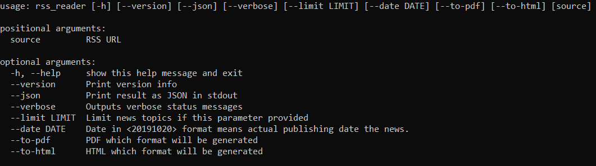
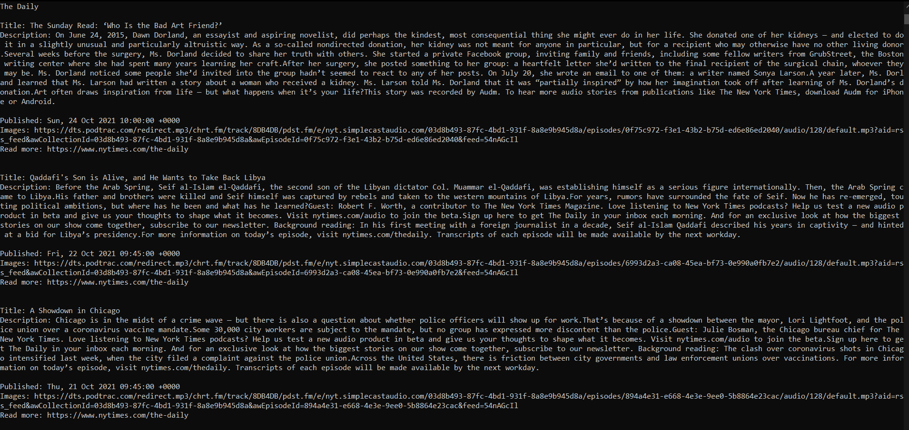
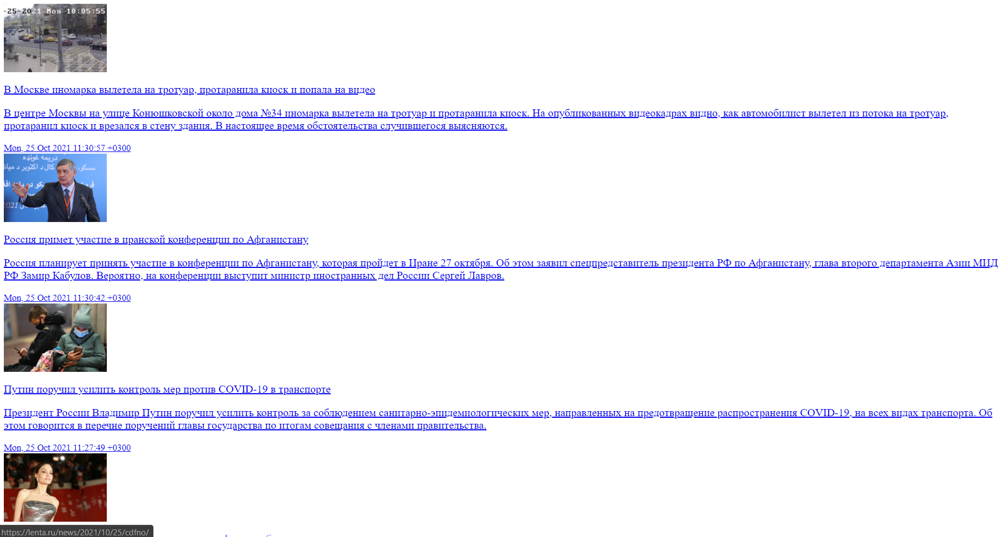
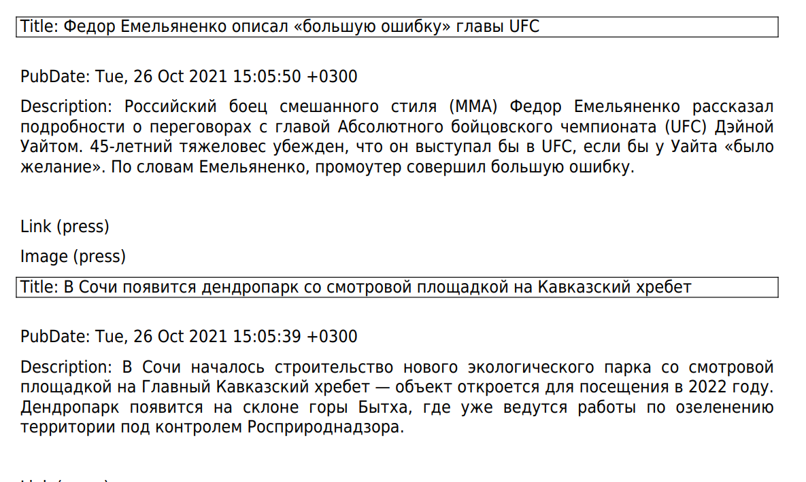

# Running
```
run script.bat
```
Now you can use my RSS reader.

# Using

```
rss_reader 
```
or
```
python rss_reader.py 
```
# Content
```
cd py-rss_reader
```     
- ***rss_package*** folder for storing program modules
- ***news_data*** folder for created pdf and json files
- ***tests*** folder for test files
- ***venv*** folder contains dependendences, settings and etc...
- ***requirements.txt*** for nessesary modules
- ***rss_reader.py*** is main program file
- ***setup.py*** is settings for client
- additional ***.eggs*** and ***rss_reader.egg-info*** folders
# Testing 
```
python -m pytest
```
# Screenshots



